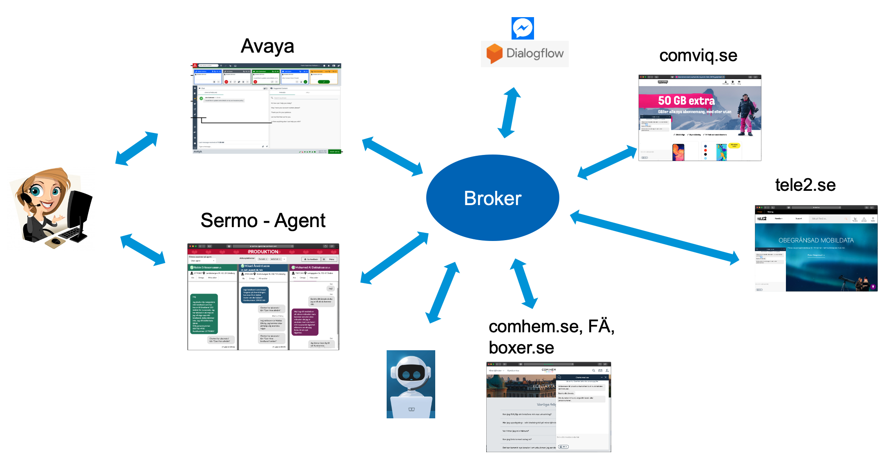

[Sermo JavaScript Bundle documentation](./sermo-bundle.md)

# One Messaging Architecture



Events sent to the broker will be sent to all other clients. This will enable clients to listen to the events it needs to in order to fullfill its responsibility. It is important that all clients can handle new events without breaking.

# Broker Events

All events are using the following attributes:

- `direction` specifies where the event is routed to. There are three different directions.
  - `inbound` - sent from customer and routed to bot and agent applications.
  - `outbound` - sent from bot or agent applications to all applications, including customer.
  - `internal` - sent from and to all applications _except_ for customer applications.
- `type` sets which type of event it is, e.i. text, typing, heartbeat, handover, etc.
- `userId` is an unique id for the customers/users. For the web a new unique id is generated for every new visit while for Messenger the user id connected to the facebook account will be used which is persistent over time.

The events are all listed below and described in more detail in following sections:

- [`inbound/text`](#inbound-text)
- [`inbound/heartbeat`](#inbound-heartbeat)
- [`inbound/messages_read`](#inbound-messages_read)
- [`inbound/client_left`](#inbound-client_left)
- [`inbound/client_unload`](#inbound-client_unload)
- [`inbound/typing`](#inbound-typing)
- [`inbound/assisted_sales_identifier`](#inbound-assisted_sales_identifier)
- [`outbound/queue_number`](#outbound-queue_number)
- [`outbound/text`](#outbound-text)
- [`outbound/info`](#outbound-info)
- [`outbound/typing_on`](#outbound-typing_on)
- [`outbound/typing_off`](#outbound-typing_off)
- [`outbound/platform_closed`](#outbound-platform_closed)
- [`outbound/end_session`](#outbound-end_session)
- [`internal/handover_to_agent`](#internal-handover_to_agent)
- [`internal/handover_to_queue`](#internal-handover_to_queue)
- [`internal/claim_session`](#internal-claim_session)
- [`internal/customer_identified`](#internal-customer_identified)
- [`internal/agent_done`](#internal-agent_done)
- [`internal/application_heartbeat`](#internal-application_heartbeat)

# Connecting to the event API

Sermo exposes a [socket.IO](https://socket.io/) server. Use the appropriate docs for your platform https://socket.io/docs/.

An API-key is required to connect. Contact the sermo team at ch-sermo@tele2.com.

| env  | host |
| -    | -    |
| dev  | sermo-api-ci1.sermo.dev-dockeree.int.comhem.com |
| prod | sermo-api.comhem.com |


The api-key is passed as a query-parameter to the socket.io endpoint. For example, using node and the socket.io-client package:

```js
const io = require('socket.io-client');
const socket = io('https://<sermo-api-host>?apiKey=<your-api-key>', {
  path: '/socket.io'
});

// Send
socket.send({ direction: 'outbound', type: 'text', ... })

// Receive
socket.on('message', ev => {
  console.log(ev);
  // -> { direction: 'outbound', type: 'text', ... }
});
```

## Troubleshooting

If you are testing the connection using your browser, please make sure that you have accepted the certificate on the test environment. Visit the health endpoint in your browser: https://sermo-api-ci1.sermo.dev-dockeree.int.comhem.com/health


## Example Scenarios

Following are example scenarios that are quite different to give a broad understanding on how the system works. Almost all are important to keep the AHT down so it is important that they are implemented.

### Standard scenario

The agent application needs to listen for all events to be able to take over the session.

1. A new customer opens a chat sessions from the web client and the web client starts sending [`heartbeat`](#inbound-heartbeat) events.
1. When the customer is typing a message the inbound [`typing`](#inbound-typing) event is sent continuously enabling the agent application to show what the customer is typing before the message is sent.
1. When the customer sends the first message an inbound [`text`](#inbound-text) event is sent.
1. The bot replies by sending an outbound [`text`](#outbound-text-from-bot) event.
1. The bot identifies the customer and sends a [`customer_identified`](#internal-customer_identified) event.
1. The bot identifies customer intent and hands the session over to the proper queue by sending [`handover_to_queue`](#internal-handover_to_queue) event.
1. The agent application sends the outbound [`info`](#outbound-info) event telling the customer that the session has been placed in queue.
1. The agent application sends the outbound [`queue_number`](#outbound-queue_number) event to show the customer current queue number. Additional `queue_number` events can be sent to update the queue number.
1. When the agent starts typing in the agent GUI an outbound [`typing_on`](#outbound-typing_on) event is sent and when the agent stops typing an outbound [`typing_off`](#outbound-typing_off) is sent.
1. When the agent wants to end the session either
   1. send an internal [`agent_done`](#internal-agent_done) to enable the customer to be handed over to another agent. Note that this will not close the session and additional inbound events may be sent.
   1. send an outbound [`end_session`](#outbound-end_session) to close the session permanently.
1. When the customer closes the chat window an inbound [`client_left`](#inbound-client_left) event is sent.

### The bot asks if the customer is still there

1. The bot identifies customer intent and who the customer is.
1. The bot handover the session by sending an internal [`handover_to_agent`](#internal-handover_to_agent) event and the session is added to the queue.
1. The bot makes sure that the customer is still there and then handing the session back to the agent application by sending a [`handover_to_agent`](#internal-handover_to_agent) event.
1. The agent application assigns the session to an agent as it would be first in line.

### The bot ends a session for the agent

1. A customer wants help with an invoice.
1. After agent has helped the customer the agent hands over the session to the bot to end the session in the name of the agent. The agent selects this option by clicking on a button dedicated for this purpose.
1. The bot asks if the customer would like help with somethings and the customer have an additional question regarding the invoice.
1. So the bot hands the session back to the agent sending the [`handover_to_agent`](#internal-handover_to_agent) event. The session pops back up for the same agent. The customer never noticed that he left the agent for a short while.

### Customer returns after agent closed session

1. After the agent has helped the customer the agent clicks down the session and an internal [`agent_done`](#internal-agent_done) event is sent out.
1. The customer receives a message that the agent has left the session and if the customer want to get in contact again, it is only to send a new message.
1. The customer sends a new message generating an inbound [`text`](#inbound-text) event.
1. The customer is put into the queue first in line.

### Count down current sessions for agent

1. An agent is working on three sessions.
1. The agent application calculate the probabilities that the customer is still there for all three sessions.
1. Since the sum of all three probabilities add upp to 1.99 a new session is distributed to the agent.

### A support session is handled by LiveChat

1. A support session is started on the platform `comviq`.
1. Sermo realizes that the session should be handled by LiveChat, a [`handover_to_queue`](#internal-handover_to_queue) event is sent with comviq_tech_support as a target queue.
1. When livechat sees the hand over event, livechat claims the session by sending a [`claim_session`](#internal-claim_session) event so Sermo knows that the session is being handled.
1. LiveChat is now in possesion of the session in question and deals with it as seen fit.

### An assisted sales session is started in Sermo and handed over to LiveChat

1. An assisted sales session is started in Sermo but the agent realizes that the customer want support help, not sales help.
1. LiveChat has been listening on all events above enabling for the future agent in LiveChat to see the previous dialog.
1. Agent in Sermo clicks on a transfer-to-queue drop down in Sermo and selects Comviq Teknisk Support. A [`handover_to_queue`](#internal-handover_to_queue) event is sent with comviq_tech_support as a target queue.
1. When livechat sees the hand over event, livechat claims the session by sending a [`claim_session`](#internal-claim_session) event so Sermo knows that the session is being handled.
1. LiveChat is now in possesion of the session in question and deals with it as seen fit.

## Common event attributes

Following attributes are used for almost all events.

- `type` sets which type of event it is, e.i. text, typing, heartbeat, handover, etc.
- `userId` is an unique id for the customers/users. For the web a new unique id is generated for every new visit while for Messenger the user id connected to the facebook account will be used which is persistent over time.

## Inbound

Inbound events are events sent from customer to the bot or the agent application.

### inbound text

Inbound messages from the customer.

```json
{
  "type": "text",
  "direction": "inbound",
  "userId": "8a8b5c18-c0dd-467b-bd77-7e7685fadf6d",
  "text": "Jag vill ändra faktura 70557076"
}
```

### inbound text with imageId

Inbound image from the customer with an appended text.

```json
{
  "type": "text",
  "direction": "inbound",
  "userId": "8a8b5c18-c0dd-467b-bd77-7e7685fadf6d",
  "text": "Some image related text",
  "imageId": "some-image-id"
}
```

The image can be retreived from http://sermo-api.comhem.com/images/IMAGE_ID

### inbound heartbeat

Inbound heartbeat is sent from the customer client so that the system can track the stability of the connection and if the customer is still there.

```json
{
  "type": "heartbeat",
  "direction": "inbound",
  "userId": "8a8b5c18-c0dd-467b-bd77-7e7685fadf6d"
}
```

### inbound messages_read

An inbound event with a timestamp on when the message was red by the customer.

```json
{
  "type": "messages_read",
  "direction": "inbound",
  "userId": "8a8b5c18-c0dd-467b-bd77-7e7685fadf6d",
  "text": "read",
  "at": "2020-02-18T12:14:11.386Z"
}
```

### inbound client_left

The customer has clicked down the chat window to close the chat.

```json
{
  "type": "client_left",
  "direction": "inbound",
  "userId": "8a8b5c18-c0dd-467b-bd77-7e7685fadf6d",
  "text": "Kunden har stängt chatten.",
  "at": "2020-02-18T12:12:33.766Z"
}
```

### inbound client_unload

The customer has closed the browser, the tab, or refreshed to page. Using https://developer.mozilla.org/en-US/docs/Web/API/Window/unload_event to detect this.

```json
{
  "type": "client_unload",
  "direction": "inbound",
  "userId": "8a8b5c18-c0dd-467b-bd77-7e7685fadf6d",
  "at": "2020-02-18T12:10:18.968Z"
}
```

### inbound typing

The inbound typing event is sent continuously when the customer is typing. This will enable the agent to see what the customer is about to send.

```json
{
  "type": "typing",
  "direction": "inbound",
  "userId": "8a8b5c18-c0dd-467b-bd77-7e7685fadf6d",
  "text": "Hej, jag mitt na",
  "at": "2020-02-18T14:41:37.571Z"
}
```

### inbound assisted_sales_identifier

Assisted sales identifier event with sales lead id and session id.

```json
{
  "type": "assisted_sales_identifier",
  "direction": "inbound",
  "userId": "89462d14-f96c-4cc1-85b2-9fa8ad8eb961",
  "niSalesLeadId": "123-abc",
  "niSessionId": "456-def"
}
```

## Outbound

Outbound events are events sent from the bot or the agent to the customer.

### outbound queue_number

Is sent when the customer is in the queue enabling the customer client to display the queue number for the customer.

```json
{
  "type": "queue_number",
  "direction": "outbound",
  "userId": "8a8b5c18-c0dd-467b-bd77-7e7685fadf6d",
  "queueNumber": 1
}
```

### outbound text

Outbound text from the agent to a customer.

The avatarId and avatarUrl property of the agent is optional. If none of these two are passed sermo will default to a icon-avatar.

```json
{
  "type": "text",
  "direction": "outbound",
  "userId": "8a8b5c18-c0dd-467b-bd77-7e7685fadf6d",
  "text": "Jag skickar ett SMS till dig nu med betalningsuppgifterna, det kommer plinga i din telefonen inom en minut.",
  "agent": {
    "id": "anan01",
    "name": "Anders Andersson",
    "type": "human",
    "avatarId": "avatar1",
    "avatarUrl": "https://some-url.png"
  }
}
```

### outbound text from bot

Outbound text sent from the bot to the customer. The client will simulate the typing for given number of milliseconds before displaying the message.

```json
{
  "type": "text",
  "direction": "outbound",
  "userId": "8a8b5c18-c0dd-467b-bd77-7e7685fadf6d",
  "text": "Hej!",
  "typing": 1000,
  "agent": {
    "id": "bot",
    "name": "Bot",
    "avatarId": "avatar1",
    "avatarUrl": "https://some-url.png"
  }
}
```

### outbound text with imageId

Outbound image sent from the agent to the customer.

```json
{
  "type": "text",
  "direction": "outbound",
  "userId": "8a8b5c18-c0dd-467b-bd77-7e7685fadf6d",
  "text": "Some image related text",
  "imageId": "some-image-id"
}
```

The image can be retreived from http://sermo-api.comhem.com/images/IMAGE_ID

### outbound info 

Outbound info event from the agent or bot to a customer. These events can be sent at any time. They will be displayed differently from normal text messages.

```json
{
  "type": "info",
  "direction": "outbound",
  "userId": "8a8b5c18-c0dd-467b-bd77-7e7685fadf6d",
  "text": "Chatten har placerats i kön \"Com Hem allmänt\""
}
```

### outbound typing_on

Outbound event sent when the agent started typing a message.

```json
{
  "type": "typing_on",
  "direction": "outbound",
  "userId": "8a8b5c18-c0dd-467b-bd77-7e7685fadf6d"
}
```

### outbound typing_off

Outbound event sent when the agent stopped typing a message.

```json
{
  "type": "typing_off",
  "direction": "outbound",
  "userId": "8a8b5c18-c0dd-467b-bd77-7e7685fadf6d"
}
```

### outbound platform_closed

Is sent by the agent application when a platform is closed to customer enabling the customer client to tell the customer.

```json
{
  "type": "platform_closed",
  "direction": "outbound",
  "userId": "8a8b5c18-c0dd-467b-bd77-7e7685fadf6d"
}
```

### outbound end_session

Is sent by the agent application when a chat session has ended. The customer is then forced to initialize a _new_ session to continue writing. `reasonText` is an optional string that will be presented to the customer.

```json
{
  "type": "end_session",
  "direction": "outbound",
  "userId": "8a8b5c18-c0dd-467b-bd77-7e7685fadf6d",
  "reasonText": "Agenten har lämnat chatten"
}
```

## Internal events

Internal events are events sent between internal broker clients, that is not sent to customer clients.

### internal handover_to_agent

Internal event used when a session needs to be handed over from bot to agent.

```json
{
  "type": "handover_to_agent",
  "direction": "internal",
  "userId": "8a8b5c18-c0dd-467b-bd77-7e7685fadf6d"
}
```

### internal handover_to_queue 

Internal event used when a session needs to be transfered from one queue to another.

```json
{
  "type": "handover_to_queue",
  "direction": "internal",
  "queueId": "comviq_support",
  "userId": "8a8b5c18-c0dd-467b-bd77-7e7685fadf6d",
}
```

### internal claim_session
```json
{
  "type": "claim_session",
  "direction": "internal",
  "userId": "8a8b5c18-c0dd-467b-bd77-7e7685fadf6d",
  "agentId": "some-agent"
}
```

### internal customer_identified

Internal event when bot or agent system have identified the customer.

```json
{
  "type": "customer_identified",
  "direction": "internal",
  "userId": "8a8b5c18-c0dd-467b-bd77-7e7685fadf6d",
  "brandId": "comhem",
  "customerId": "1234567"
}
```

### internal agent_done

Internal event sent when the agent closes the session.

```json
{
  "type": "agent_done",
  "direction": "internal",
  "userId": "8a8b5c18-c0dd-467b-bd77-7e7685fadf6d"
}
```

### internal application_heartbeat

Internal event sent to notify sermo that the specified application is alive and ready. This event should be sent periodically with a period of 30s (unless otherwise agreed).

- `available` specifies whether or not the application is currently available to receive chat sessions. I.e., set to `false` outside of chat opening hours.

Example payload:

```json
{
  "type": "application_heartbeat",
  "direction": "internal",
  "available": true
}
```

# Broker endpoint

# POST /images?apiKey=SOME_API_KEY

To upload images from the agent.

```json
{
  "image": "b64-image-content"
}
```

This endpoint responds with the location of the image within it's location header.
The id of the image is the last part of that url and that is the id that should be passed with the corresponding text event.

An api-key needs to be supplied as a query parameter.

# GET /images/IMAGE_ID

Used to get images uploaded either by clients or agents.
