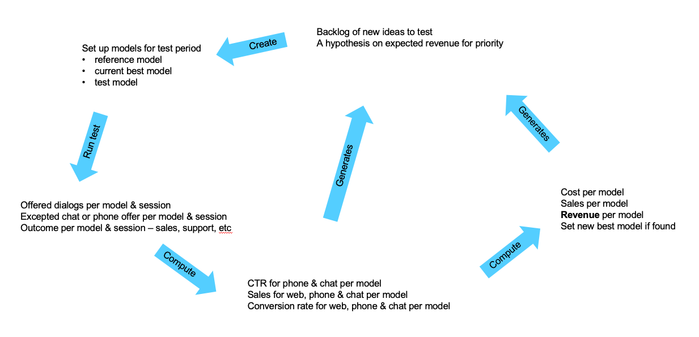

# Test Cycle API



The purpose of this test cycle is to be able to compare different models over time maximizing the revenue.

## Events 

The API is based on events. Following are common attributes for all events.
- ``type`` is the type of event occurred
- ``userTrackingId`` is a unique id for the web session. If possible it should be the GA id
- ``at`` is the time when the event occurred     

### model_assigned event
This event is sent to assign a model to a web session.  
```json
{
  "type": "model_assigned",
  "userTrackingId": "GA1.2.1500669880.1586985368",
  "at": "2020-02-18T14:41:37.571Z",
  "modelId": "reference_v16"
}
```

### assistance_triggered event
This event is sent when algorithms trigger to offer an assistance. The attribute ``assistanceOffered`` is ``true`` if 
an offer to the user was done and ``false`` if the session was picked for assistance but it was not possible due to
other reasons like no agents available. This enables us to compute the potential of a model even if we have 
temporary restrictions like no available agents. Since there can be more than one assistance per web session,  
``assistanceId`` is used to add more events to a particular assistance later on.
```json
{
  "type": "assistance_triggered",
  "userTrackingId": "GA1.2.1500669880.1586985368",
  "at": "2020-02-18T14:41:37.571Z",
  "assistanceId": "1234567",
  "assistanceOffered": true
}
```

### offer_accepted event
This event is sent when user is accepting assistance. 
```json
{
  "type": "offer_accepted",
  "userTrackingId": "GA1.2.1500669880.1586985368",  
  "at": "2020-02-18T14:41:37.571Z",
  "assistanceId": "1234567",
  "userSelectionId": "chat"
}
```

### assistance_started event
This event is sent when the agent started to assist the user. 
```json
{
  "type": "assistance_started",
  "userTrackingId": "GA1.2.1500669880.1586985368",
  "at": "2020-02-18T14:41:37.571Z",
  "assistanceId": "1234567"
}
```

### outcome event
This event is sent when the agent started to assist the user. 
```json
{
  "type": "outcome",
  "userTrackingId": "GA1.2.1500669880.1586985368",  
  "at": "2020-02-18T14:41:37.571Z",
  "assistanceId": "1234567",
  "outcomeId": "sales_2"
}
```
